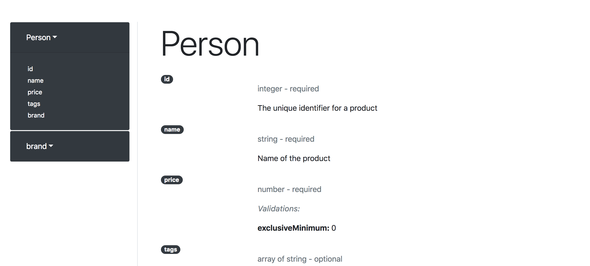

# json-schema-renderer
Basic json-schema to HTML doc generator.




This is fairly primitive at the moment, and only supports [draft-06](http://json-schema.org/specification-links.html#draft-6). This is because it is the most supported version which uses the `examples` field.

# Usage

json-schema-renderer requires [SBT](https://www.scala-sbt.org/). In your terminal, run

`sbt 'run <IN_FOLDER> <OUT_FOLDER>'`

This will find all the `.json` files in `IN_FOLDER` recursively, omitting hidden folders, then:
- for each file, create an equivalent HTML file representing this schema, and save it in `OUT_FOLDER`, respecting the file hierarchy found in `IN_FOLDER`
- create an `index.html` at the root of the `OUT_FOLDER` that links to the above pages

Thus, if `IN_FOLDER`'s layout looks like:
```
bla.json
bli
|__blu.json
```

Then after running the program, the `OUT_FOLDER` will look like
```
index.html
main.css
bla.html
bli
|__blu.html
```

Note that, for simplicity of code and representation, there are a few constraints you need to respect when creating the schemas:
- You need to have a `definitions` field at the top level, even if empty
- The root schema and the ones at the top level of its `definitions` property are the only ones where the `object` type is allowed. If you have nested objects, you need to move it to `definitions` and reference it (`$ref` property). This allows for a flat representation of the schema.
- Because we don't want to support the great variety of ways to represent internal references, we choose the one where
  - We don't use the `$id` field in the definition, just the field name
  - We reference the definition like so `{ "$ref": "#/definitions/<DEFINITION_NAME>" }`
